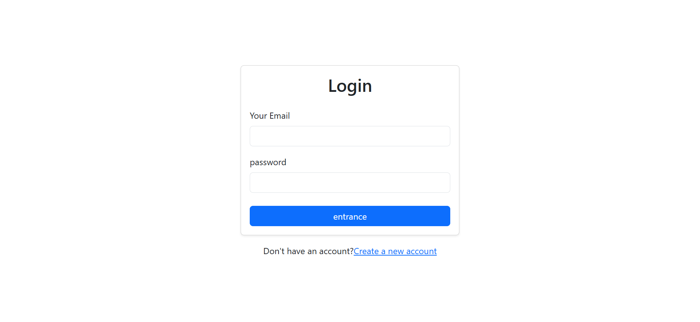

# 🔐 React Authentication with Supabase

A full-stack Authentication and User Management system built with **React** and **Supabase**, featuring secure signup, login, and dynamic user profile data tracking.

## 📸 Preview

## ✨ Features
* 🔑 **Full Auth Flow:** Secure user Registration (Signup) and Authentication (Login) handled via Supabase Auth.
* 👤 **User Profile Dashboard:** Displays the logged-in user's email along with their unique, secure Supabase User ID (UID).
* 🎨 **Clean Minimalist UI:** User-friendly login form design with smooth validation state tracking.
* 🛡️ **Session Persistence:** Automatically remembers logged-in users using secure token session storage.

## 🛠️ Tech Stack
* React (Vite)
* Supabase Auth (Backend & Database)
* React Bootstrap (UI Components)
* React Router DOM (Navigation)

## 📂 Project Structure & Architecture

REACT AUTH SUPABASE
├── 📁 node_modules
├── 📁 src
│   ├── 📁 components
│   │   ├── 📄 AuthCallback.jsx  ← Handles the magic link callback for email confirmation
│   │   ├── 📄 Dashboard.jsx     ← Main home screen displaying user email and unique UID after login
│   │   ├── 📄 Login.jsx         ← UI interface for registered users to log in
│   │   └── 📄 Signup.jsx        ← UI interface for registering new user accounts
│   ├── 📄 AuthContext.jsx       ← Global authentication state manager and session listener
│   ├── 📄 supabaseClient.jsx   ← Secure connection bridge between React and Supabase backend
│   ├── 📄 App.jsx               ← Route orchestrator and protected routes guard
│   └── 📄 main.jsx              ← Application entry point wrapping the app with AuthProvider
├── 📄 .env                      ← Environment variables holding secure API keys (Kept local)
└── 📄 .gitignore                ← Specifies intentionally untracked files to keep API keys safe from GitHub

## 🚀 Live Demo & Preview

🔗 https://

